# GovTrack Jobs — Government Jobs & Exams Portal

A full-stack platform that tracks Indian government recruitments — jobs, admit cards, results, answer keys and exam dates — and publishes them with links to the official source. A scraper checks official recruitment sites every two hours and publishes new notices automatically, while an admin panel handles corrections, hand-written posts, visitor questions and a blog.

**Live site:** https://jobportal-phi-topaz.vercel.app

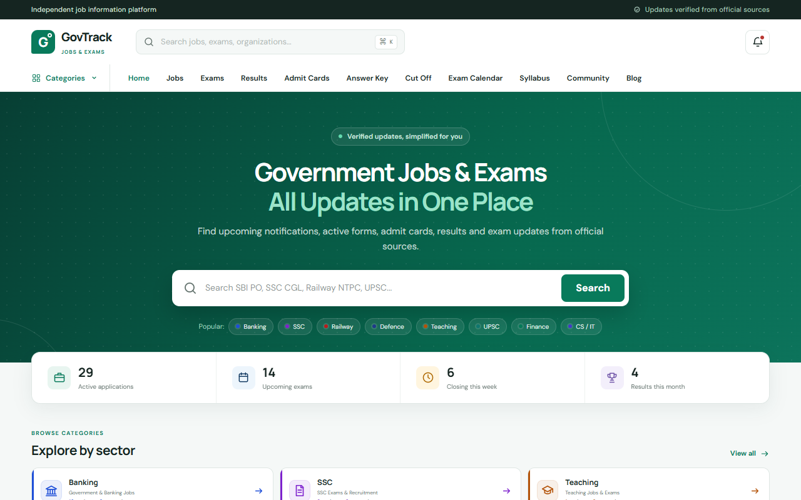

## Highlights

- **Automatic publishing** — a Node.js scraper (GitHub Actions, every 2 hours) reads official sites such as IBPS, SBI, RBI, ISRO, BEL and DSSSB, removes duplicates, rejects old notices and publishes new ones with their official links.
- **Sector-coded design** — 13 sectors (Banking, SSC, Railway, Defence, Teaching…) each have their own colour, carried through cards, badges, category pages and the "View details" button, independent of recruitment status colours.
- **Status from dates** — Upcoming, Active, Closing Soon, Closed and Exam are calculated from application and exam dates instead of being set by hand.
- **SEO built in** — Vercel functions server-render job and blog pages with titles, descriptions, Open Graph tags and JSON-LD (`JobPosting`, `BlogPosting`, `BreadcrumbList`), a live sitemap lists every page, and URLs carry the job title.
- **Community Q&A** — visitors ask questions on any job without an account; questions appear after moderation, optionally with an answer.
- **Admin panel** — review queue with one-click reject, add jobs by hand, moderate questions, and a Markdown blog editor with a live Google-result preview.

## Screenshots

| Job detail | Sector page |
|---|---|
| 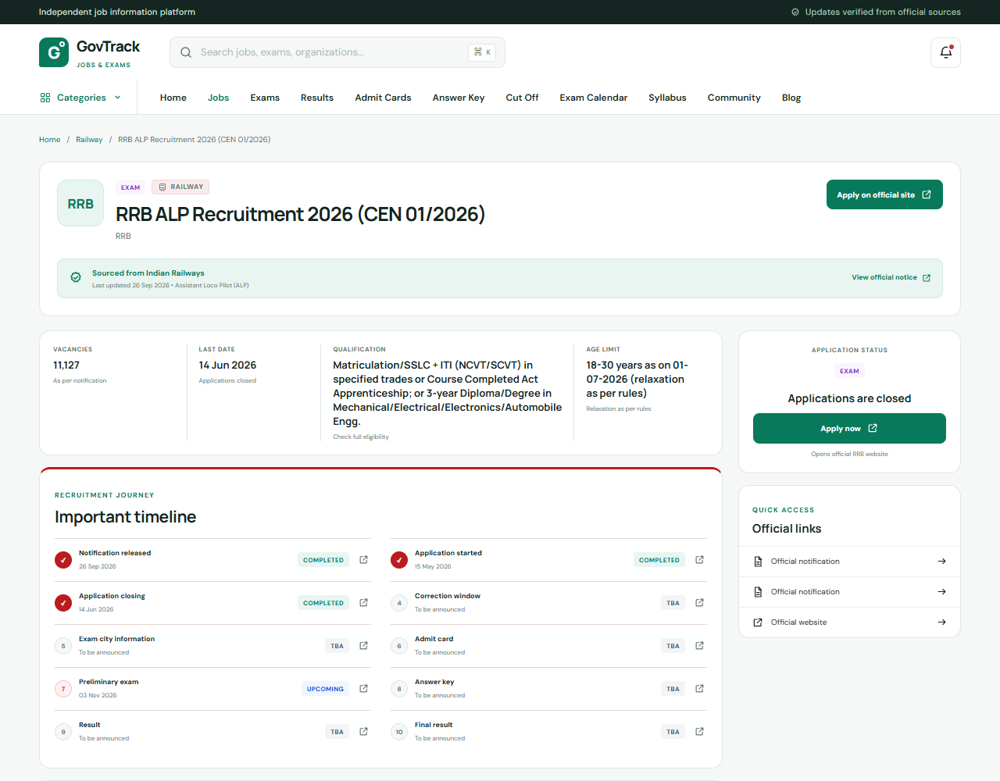 | 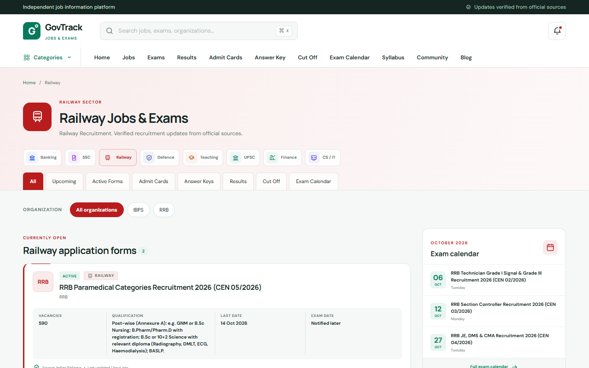 |

| Exam calendar | Explore by sector |
|---|---|
| 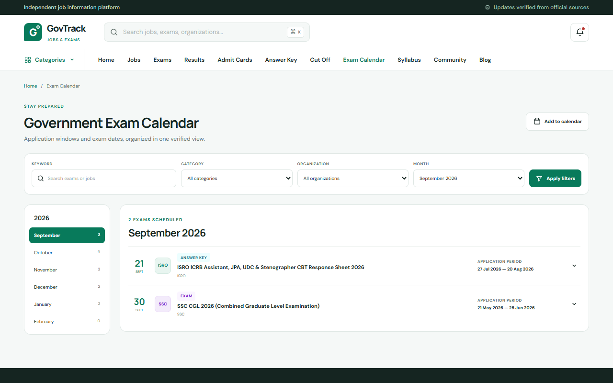 | 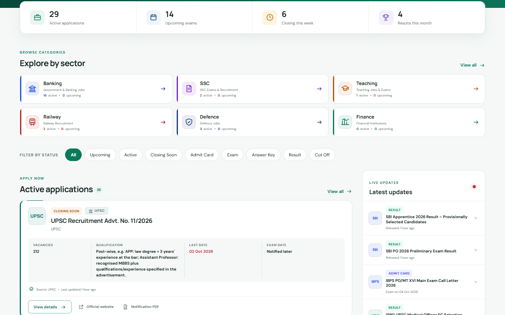 |

| Blog article | Community Q&A |
|---|---|
| 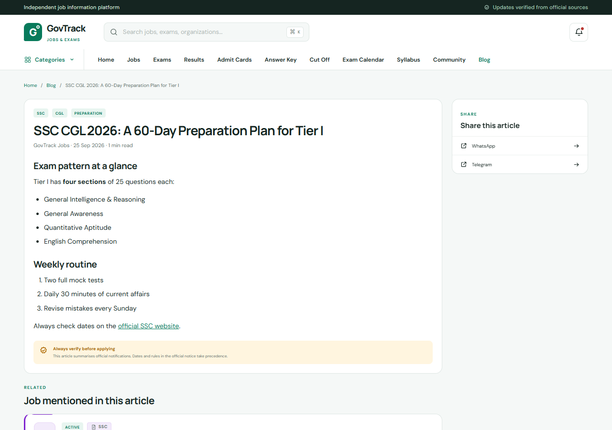 | 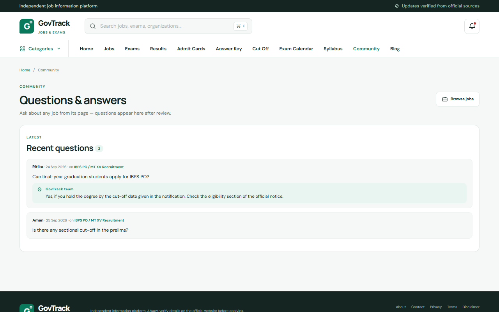 |

| Admin: review queue | Admin: blog editor with SEO preview |
|---|---|
| 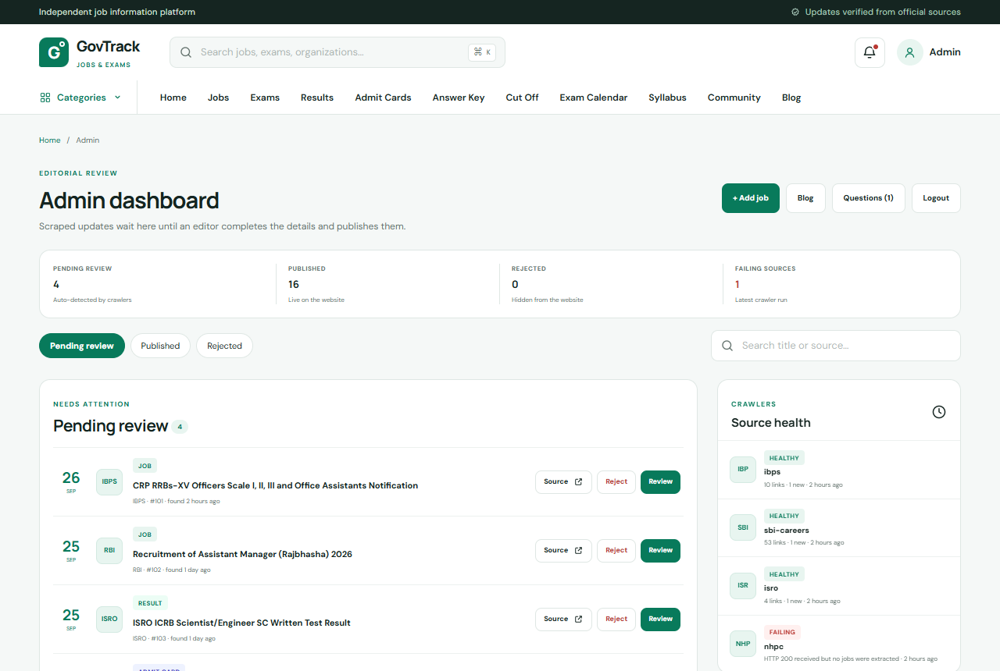 | 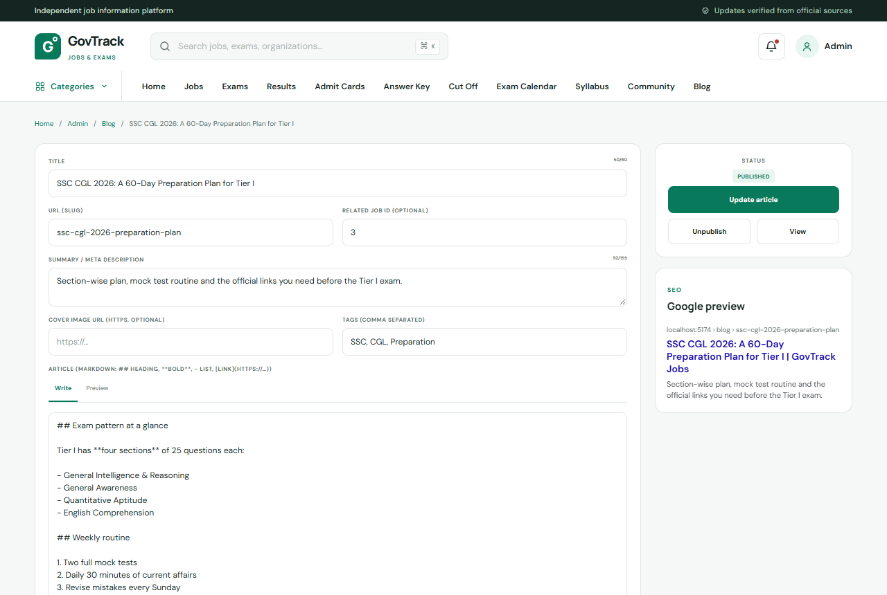 |

<p>
  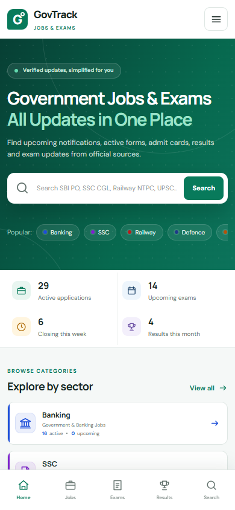
  &nbsp;
  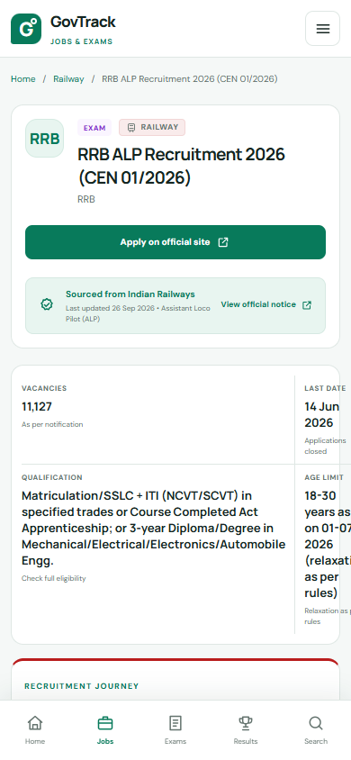
</p>

## How it works

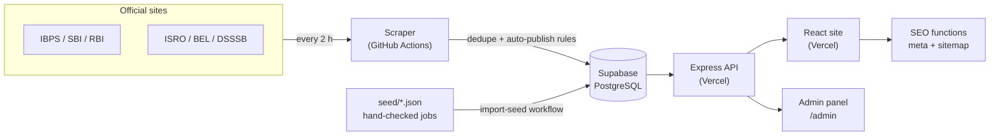

1. **Collect** — `scraper.js` fetches each source in `sources.json`, extracts links and classifies them (job, admit card, result, answer key).
2. **Filter** — `auto-publish.js` rejects notices that mention only past years or have old upload dates, keeps vague titles ("Click here…") for review, and publishes the rest; duplicates are matched by URL and title similarity.
3. **Curate** — recruitments researched by hand go into `seed/jobs.json`; corrections go into `seed/overrides.json`. Merging to `main` runs the `import-seed` workflow, so no SQL is needed.
4. **Serve** — the Express API reads published posts; the React app renders them, and Vercel functions add page-specific SEO for crawlers and link previews.

## Tech stack

| Layer | Technology |
|---|---|
| Frontend | React 18, Vite, Tailwind CSS v4, React Router, react-helmet-async |
| Backend | Node.js, Express 5, Helmet, express-rate-limit |
| Database & auth | Supabase (PostgreSQL, Row Level Security, Auth) |
| Scraping | Node.js, Cheerio, undici, PDF text extraction |
| Automation | GitHub Actions (scheduled scraper, seed import) |
| Hosting & SEO | Vercel (static site, serverless API, SEO/sitemap functions) |
| Content | Markdown blog with marked + DOMPurify |
| Design | Figma (GovTrack design system) |

## Project structure

```
api/                 Express API (public jobs, auth, admin, Q&A, blog)
public-portal/       React site + admin panel
  api/               Vercel functions: SEO render and sitemap
  seo/render.js      Server-side meta / JSON-LD renderer
  src/lib/           Sector config, status rules, filters, slugs
scraper.js           Source scraper
auto-publish.js      Publishing rules (stale / generic / publish)
scripts/             Seed import
seed/                Hand-checked jobs, rejects and corrections
migrations/          SQL for Q&A and blog tables
sources.json         Scraper source list and filters
```

## Running locally

```bash
npm install
npm --prefix public-portal install
# Preview the site with sample data (no database needed):
cd public-portal && VITE_DEMO_DATA=true npm run dev
```

Full setup — Supabase schema, environment variables, deployment and scraper operations — is in [docs/SETUP.md](docs/SETUP.md).

## Notes

- All job information links back to the official recruiting organisation; the site is an independent information service and is not affiliated with any government body.
- The scraper reads public pages only and does not bypass logins or CAPTCHAs.

## Author

Built by [Mayank Kumar Singh](https://github.com/mayankksingh5).

Released under the [MIT License](LICENSE).
